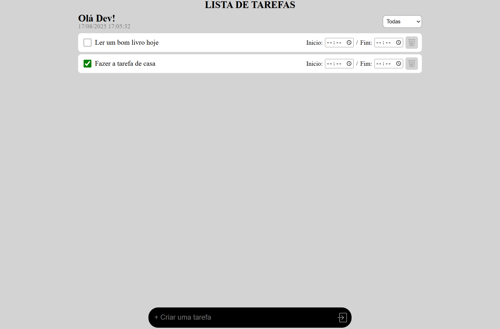

# TO-DO List Interativa (Lista de Tarefas)

## 📖 Visão Geral

Este é um projeto de uma Lista de Tarefas (TO-DO List) interativa criada com HTML, CSS e JavaScript puro. A aplicação permite que o usuário adicione, remova e filtre tarefas, além de contar com um sistema de alarmes sonoros para o início e fim de cada atividade, transformando-a em uma ferramenta de gerenciamento de tempo.

O projeto foi desenvolvido para demonstrar a manipulação dinâmica do DOM, gerenciamento de eventos e controle de estado com JavaScript.

## ✨ Funcionalidades Principais

* **Adicionar Tarefas**: O usuário pode digitar uma nova tarefa no campo de input e adicioná-la à lista com um clique.
* **Remover Tarefas**: Cada tarefa possui um botão de lixeira que a remove da lista.
* **Filtrar Tarefas**: É possível filtrar a visualização entre "Todas", "Pendentes" e "Concluídas" com base no status do checkbox de cada tarefa.
* **Relógio em Tempo Real**: Um relógio no cabeçalho exibe a data e a hora atuais, atualizando a cada segundo.
* **Alarmes de Início e Fim**:
    * Cada tarefa possui campos de tempo para definir um horário de início e um de fim.
    * Um alarme sonoro é disparado no minuto exato do início e do fim da tarefa.
    * O fundo da tarefa fica **verde** no minuto do início e **vermelho** no minuto do fim.
* **Validação de Horário**: O campo de horário de fim não permite selecionar um tempo que seja anterior ao horário de início definido, evitando erros do usuário.
* **Controle de Estado do Alarme**: A lógica garante que o alarme de cada evento (início/fim) toque apenas uma vez por minuto, adicionando uma classe de "marcador" para controlar o estado.

## 🛠️ Tecnologias Utilizadas

* **HTML5**: Estrutura principal da página.
* **CSS3**: Estilização dos componentes, utilizando Flexbox para o layout.
* **JavaScript (ES6+)**: Toda a lógica de interatividade, incluindo:
    * Manipulação do DOM (criação e remoção de elementos).
    * Delegação de Eventos (`addEventListener` na `<ul>`).
    * Funções de tempo (`setInterval` para o relógio e para a verificação dos alarmes).
    * Manipulação de atributos (`setAttribute` para a validação de tempo).
    * Controle de classes (`classList.add`, `classList.remove`, `classList.contains`).

## ⚙️ Como Funciona a Lógica dos Alarmes

O coração do sistema de alarmes é uma função `setInterval` que roda a cada segundo:

1.  **"Ronda" Completa**: A cada segundo, o script seleciona todas as tarefas (`.item_lista`) presentes na página.
2.  **Verificação Individual**: Usando um loop `forEach`, ele "visita" cada tarefa individualmente.
3.  **Coleta de Dados**: Para cada tarefa, ele lê os valores dos inputs de início e fim e pega a hora atual do sistema.
4.  **Comparação e Ação**:
    * Ele compara a hora atual com a hora de início. Se a hora for a mesma e o alarme de início ainda não tiver tocado (verificado por uma classe "marcador"), ele toca o som, pinta o fundo de verde e adiciona a classe "marcador".
    * Caso contrário, ele compara a hora atual com a hora de fim. Se a hora for a mesma e o alarme de fim não tiver tocado, ele toca o som, pinta o fundo de vermelho e adiciona a sua própria classe "marcador".
    * Se não for nem hora de início nem de fim, ele garante que o fundo da tarefa fique branco e remove as classes "marcador".

Essa abordagem garante que cada tarefa seja independente e que os alarmes não entrem em conflito.

## 🚀 Como Executar

1.  Clone este repositório.
2.  Abra o arquivo `index.html` em qualquer navegador web moderno.
3.  Adicione tarefas, defina horários e veja a mágica acontecer!